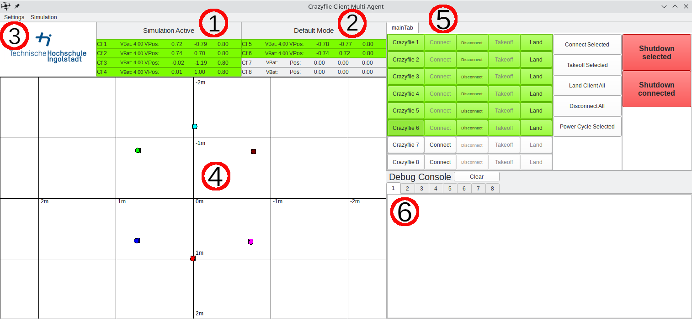

# Crazyflie Client Multi-Agent (THA/THI Base Station)

The Multi-Agent Client provides the user with a graphical user interface (GUI) to interact with currently up to eight Crazyflies. It builds upon the Qt framework and utilizes Bitcraze’s Crazyflie Python API (cflib) for interfacing the Crazyflies.

Intended for use with either physical Crazyflies or within a simulation environment utilizing the *sim_cf2* flight simulator.

## Installation

Tested on an Ubuntu 22.04 LTS machine

### Dependencies

pip and a lib for the Qt GUI

```bash
sudo apt install python3-pip libxcb-xinerama0 libxcb-cursor0
```

```bash
pip3 install --upgrade pip
```

PyQt 5

```bash
pip3 install PyQt5
```

posix-ipc module for python

```bash
pip3 install posix-ipc
```

### cflib

Clone the Crazyflie python library with additional *simlink* driver from https://github.com/CrazyflieTHI/crazyflie-lib-python (assuming into ~/repos folder)

```bash
cd ~/repos
```

```bash
git clone https://github.com/CrazyflieTHI/crazyflie-lib-python
```

Install the *cflib*

```bash
cd  crazyflie-lib-python
```

```bash
pip3 install --user -e .
```

## Start the GUI

Move into the repository (assuming ~/repos)

```bash
cd ~/repos/crazyflie-client-multi-agent-thi
```

Start the Multi-Agent Client gui by running the gui.py

```bash
python3 gui.py
```

## Overview

The user interface consists of several parts arranged in one main window as depicted in Figure 1.


Fig. 1 - Main Window of the Multi-Agent Client Graphical User Interface
</br>
</br>

**(1) Simulation/Regular Mode:** Info whether the GUI is interfacing simulated or real Crazyflies. Simulation mode (*sim_cf2*) can be toggled through the *Simulation* menu entry.

**(2) Gui Operation Mode:** In order to use the client for different application areas, individual operation modes can be integrated and selected through the *Settings* menu point. Currently the public client features only the default operation mode.

**(3) Settings:** Besides the selection of the operation modes, the interactive map can be customized.

**(4) Interactive Map:** Map showing a 2D representation of the flight area. The map is provided with a cartesian coordinate system for better orientation. Connected Crazyflies are represented by circles of a unique color assigned to a Crazyflie. Squares represent a goal position that is set by clicking on the map while a Crazyflie is selected.

**(5) Main Tab:** Each operation mode has an adapted main tab with the necessary basic functionality to command the Crazyflies. Additional tabs may be added in the tabs window specific to an operation mode to extend the functionality.

**(6) Debug Consoles:** A debug console is assigned to each Crazyflie displaying DEBUG_PRINTS sent from the firmware.

## Configuration

Configuration files are located in the *config* folder. After the first invocation of the gui, a copy of the *default_bs_config.json* is created and used for individual settings. Customizations through the GUI take place in this local configuration file and therefore direct adjustments to the configuration also need to be performed in the local configuration file.

Three categories contain the settings for the gui

```json
"main": {
    "mode": "default",
    "simulation": "True"
},
```
*mode*: Currently active operation mode. `default` is currently the only available operation mode.</br>
*simulation*: Interfacing simulated (*sim_cf2*) Crazyflies if `True`

```json
"interactiveMap": {
    "setting": "Laboratory",
    "width": 5,
    "depth": 4
},
```
*setting*: `Laboratory` setting incorporates a Cartesian coordinate system with its origin positioned at the center of the interactive map. `Default` setting is designed with the coordinate origin placed at the left bottom corner of the interactive map.</br>
*width* and *depth*: Dimensions of the flight area in meters.

```json
"crazyflies": {
    "radio://0/80/2M/E7E7E7E701": 996028180225,
    "radio://0/80/2M/E7E7E7E702": 996028180226,
    "radio://0/80/2M/E7E7E7E703": 996028180227,
    "radio://0/80/2M/E7E7E7E704": 996028180228,
    "radio://0/80/2M/E7E7E7E705": 996028180229,
    "radio://0/80/2M/E7E7E7E706": 996028180230,
    "radio://0/80/2M/E7E7E7E707": 996028180231,
    "radio://0/80/2M/E7E7E7E708": 996028180232
}
```
*Crazyflies*: link_uris of the Crazyflies and their addresses.
